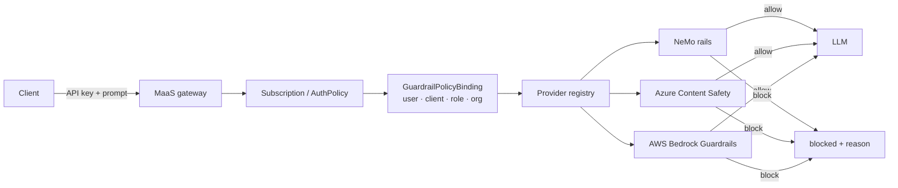

# Advanced Guardrails — Plan

Branch: `advanced-guardrails` (from `rhoai-3.5-ea`)  
Audience: platform / security stakeholders evaluating **scoped content policies** and **pluggable guardrail providers** on RHOAI MaaS.

> **Honesty bar:** Day 4 today ships a **single** `NemoGuardrails` instance with one ConfigMap. Multi-scope binding and third-party providers are **PoC architecture + demo harness**, not a shipped MaaS CR. Present as target shape + live proofs, not GA product UI.

---

## Goals

1. **Scoped policies** — apply guardrails independently at **user**, **client**, **role/group**, and **org** levels (same identity dimensions as Day 6 subscriptions).
2. **Pluggable providers** — one check surface; backends swappable (NeMo today; Azure Content Safety / AWS Bedrock Guardrails / enterprise API Intercept as plugins). Pattern inspired by [PANW AI Runtime Security + NVIDIA NeMo Guardrails](https://www.paloaltonetworks.com/blog/network-security/securing-genai-with-ai-runtime-security-and-nvidia-nemo-guardrails/).

---

## Architecture (target)



**Separation of concerns**

| Layer | Decides | Existing PoC artifact |
|-------|---------|------------------------|
| Auth / subscription | *Who* may call *which model* | `MaaSSubscription`, `MaaSAuthPolicy` (Days 2–6) |
| Guardrail binding | *Which content policy pack* applies | `GuardrailPolicyBinding` (conceptual — Day 4/6 manifests) |
| Provider plugin | *Who enforces* the pack | Provider registry ConfigMap + demo harness |

---

## Two short demos (≈5 min each)

### Demo A — Scoped guardrail policies

| Scope | Identity | Policy pack | Prompt | Expected |
|-------|----------|-------------|--------|----------|
| Org | Retail (`org-retail` / `DEMO_RETAIL_KEY`) | `rails-retail` — PII + secrets regex | `My password is secret123` | **blocked** (NeMo / retail pack) |
| Org | Risk (`org-risk` / `DEMO_RISK_KEY`) | `rails-risk` — jailbreak + SSN; ops allow “password” | Same password prompt | **success** (pack difference) |
| Role | Platform (`maas-demo-platform-ops`) | `rails-platform` — baseline + admin diagnostics | Soft “password reset” wording | **success** where retail fails |
| Client (optional) | Annotation `clientId: mobile-banking` | Stricter than org default | Short PII | Client binding wins |

**Live proof:** [`day-4/demo-advanced-guardrails.sh`](day-4/demo-advanced-guardrails.sh) `scoped` mode — maps persona key → binding → pack → check.

### Demo B — Pluggable providers

Same unsafe prompt through:

| Provider | Mode | What audience sees |
|----------|------|--------------------|
| `nemo` | Live Day 4 route | `"provider":"nemo"`, regex/Presidio reason |
| `azure` | Mock (or real if configured) | Azure-shaped categories / severity |
| `aws` | Mock (or real if configured) | Bedrock Guardrail action / intervening |

Defense-in-depth talking point (PANW pattern): local NeMo rails first (fast), optional enterprise provider second.

**Live proof:** same script `providers` mode.

---

## Day-by-day integration

| Day | Change on this branch |
|-----|------------------------|
| **1** | Note: persona groups (htpasswd) are prerequisites for org/role-scoped guardrail demos — [day-1/README.md](day-1/README.md) |
| **2** | TrustyAI remains Managed (NeMo CRDs); no new models required — [day-2/CHANGES-3.5-ea.md](day-2/CHANGES-3.5-ea.md) |
| **3** | Auth demos unchanged; guardrails stay content-layer (not a substitute for 401/403) — [day-3/README.md](day-3/README.md) |
| **4** | Baseline NeMo + **advanced** ConfigMaps, bindings, provider registry, demo harness — [day-4/](day-4/) |
| **5** | External models still use same gateway; content policy is orthogonal to `ExternalModel` — [day-5/README.md](day-5/README.md) |
| **6** | Persona orgs (`org-retail` / `org-risk` / `org-platform`) bind to policy packs — [day-6/manifests/demo-guardrail-bindings.yaml](day-6/manifests/demo-guardrail-bindings.yaml) |
| **7** | Lightspeed optional; no guardrail change required — [day-7/README.md](day-7/README.md) |

Install order remains Days 1→7 per [08-rhoai-3.5-ea-install.md](08-rhoai-3.5-ea-install.md). Advanced guardrails apply after Day 4 NeMo Ready and Day 6 persona keys.

```bash
# After Day 4 + Day 6
./day-4/run-day4-install.sh          # includes advanced manifests when present
./day-6/run-day6-install.sh          # personas + optional guardrail bindings
source day-6/demo-users.env
./day-4/demo-advanced-guardrails.sh scoped
./day-4/demo-advanced-guardrails.sh providers
```

---

## Artifacts

| Path | Purpose |
|------|---------|
| [day-4/manifests/advanced-guardrails/](day-4/manifests/advanced-guardrails/) | Policy packs, bindings, provider registry |
| [day-4/demo-advanced-guardrails.sh](day-4/demo-advanced-guardrails.sh) | Scoped + provider demo harness |
| [day-6/manifests/demo-guardrail-bindings.yaml](day-6/manifests/demo-guardrail-bindings.yaml) | Org/role bindings aligned to demo personas |
| [05-demonstration-steps.md](05-demonstration-steps.md) Demo 5 | Terminal presenter (baseline + A/B) |
| [07-ui-based-demonstration-steps.md](07-ui-based-demonstration-steps.md) Demo 5 | UI-adjacent + terminal proofs |

---

## Conceptual CR shapes (RFE / slide)

```yaml
# Not a current MaaS API — target shape for product discussion
apiVersion: maas.opendatahub.io/v1alpha1
kind: GuardrailPolicyBinding
metadata:
  name: retail-org-rails
spec:
  target:
    organizationId: org-retail   # also: user, clientId, groups[]
  providerRef: nemo-default
  configRef: rails-retail
  priority: 100                  # higher wins when multiple match
---
apiVersion: maas.opendatahub.io/v1alpha1
kind: GuardrailProvider
metadata:
  name: nemo-default
spec:
  type: nemo
  endpointRef: nemo-poc-guardrails
```

---

## Out of scope (this branch)

- Gen AI Studio Guardrails policy editor UI
- Real Azure / AWS credentials in git (use mocks or local `.env` — never commit)
- Replacing MaaS AuthPolicy with content filters
- Claiming multi-scope guardrails are GA in RHOAI 3.5-ea

---

## Success criteria

- [ ] Same prompt, **retail vs risk** keys → different allow/block (Demo A)
- [ ] Same prompt, **nemo vs azure vs aws** → same outer contract, different `provider` / reasons (Demo B)
- [ ] Day 4 baseline Demo 5 (safe / password block) still works
- [ ] 05 and 07 presenter scripts document both advanced demos
- [ ] No secrets committed

---

## References

- [PANW + NeMo defense-in-depth](https://www.paloaltonetworks.com/blog/network-security/securing-genai-with-ai-runtime-security-and-nvidia-nemo-guardrails/)
- [RHOAI NeMo Guardrails docs (3.4)](https://docs.redhat.com/en/documentation/red_hat_openshift_ai_self-managed/3.4/html/enabling_ai_safety_with_guardrails/enabling-ai-safety-with-nemo-guardrails_nemo-guardrails)
- Existing PoC: [day-4/README.md](day-4/README.md), [05 Demo 5](05-demonstration-steps.md#demo-5-nemo-guardrails-content-safety)
