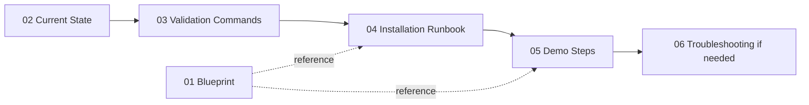

# RHOAI MaaS PoC

Centralized Model-as-a-Service governance demonstration on Red Hat OpenShift AI — enterprise AI gateway, subscription-based entitlements, token rate limits, observability showback, and external model routing.

**Objective:** Evaluate RHOAI MaaS as an enterprise-wide "single front door" for compliance, auditing, and multi-tenant model routing.

| Track | Branch / docs | RHOAI channel |
|-------|---------------|---------------|
| GA / 3.4 baseline | `main` + [04-installation-and-ready-state.md](04-installation-and-ready-state.md) | `stable-3.x` / `stable-3.4` |
| **3.5 Early Access** | `rhoai-3.5-ea` + [08-rhoai-3.5-ea-install.md](08-rhoai-3.5-ea-install.md) | `beta` → `rhods-operator.3.5.0-ea.2` |

---

## Quick start

1. Clone this repo and configure secrets — see **[CONFIGURATION.md](CONFIGURATION.md)** (copy `.example` → local `.env` files; never commit keys).
2. Assess cluster — [02-cluster-current-state.md](02-cluster-current-state.md)
3. Install — [04-installation-and-ready-state.md](04-installation-and-ready-state.md) (Days 1–7)
4. Present — [05-demonstration-steps.md](05-demonstration-steps.md) or [07-ui-based-demonstration-steps.md](07-ui-based-demonstration-steps.md)

**AI agents:** read [AGENTS.md](AGENTS.md) before making changes.

---

## Cluster URLs (your environment)

Derive from your OpenShift cluster; do not commit hostnames:

```bash
export CLUSTER_DOMAIN=$(oc get ingresses.config/cluster -o jsonpath='{.spec.domain}')
export MAAS_URL="https://maas.${CLUSTER_DOMAIN}"
echo "MaaS gateway: ${MAAS_URL}"
```

| Console | Typical pattern |
|---------|-----------------|
| MaaS gateway | `https://maas.${CLUSTER_DOMAIN}` |
| RHOAI AI Console | `https://rh-ai.${CLUSTER_DOMAIN}` or dashboard route in `redhat-ods-applications` |
| OpenShift Console | `https://console-openshift-console.${CLUSTER_DOMAIN}` |

---

## Document index

| # | Document | Purpose |
|---|----------|---------|
| 01 | [Engineering Blueprint](01-engineering-blueprint.md) | Architecture, feature matrix, use cases |
| 02 | [Cluster Current State](02-cluster-current-state.md) | Assessment and gap analysis |
| 03 | [Validation Commands](03-cluster-validation-commands.md) | Copy-paste `oc` and `curl` health checks |
| 04 | [Installation and Ready State](04-installation-and-ready-state.md) | Multi-day install runbook (3.4 baseline) |
| 08 | [RHOAI 3.5-ea Install](08-rhoai-3.5-ea-install.md) | Early Access (`beta` / 3.5.0-ea.2) MaaS path |
| 05 | [Demonstration Steps](05-demonstration-steps.md) | Terminal presenter script |
| 06 | [Troubleshooting](06-troubleshooting.md) | Known issues and recovery |
| 07 | [UI-Based Demonstration Steps](07-ui-based-demonstration-steps.md) | RHOAI Console presenter script |
| — | [Configuration](CONFIGURATION.md) | Local `.env` files and secrets |
| — | [Multi-User Access](MULTI-USER-ACCESS.md) | htpasswd personas and per-user API keys |
| — | [Day 1–7 Results](day-1/README.md) | Per-day install notes under `day-N/` |

---

## Recommended workflow



---

## External resources

| Resource | URL |
|----------|-----|
| RHOAI MaaS Guide | https://github.com/rh-aiservices-bu/rhoai-maas-guide |
| MaaS upstream | https://github.com/opendatahub-io/models-as-a-service |
| RHOAI 3.4 MaaS docs | https://docs.redhat.com/en/documentation/red_hat_openshift_ai_self-managed/3.4/html-single/govern_llm_access_with_models-as-a-service/index |
| AI Gateway flow animation | https://noyitz.github.io/ai-gateway-docs/ai-gateway-flow.html |

---

## PoC capabilities (Days 1–7)

1. GPU platform + MaaS operators (Day 1)
2. PostgreSQL, models, subscriptions (Day 2)
3. Gateway auth, API keys, rate limits (Day 3)
4. Unified BBR routing, NeMo Guardrails (Day 4)
5. External model via `ExternalModel` (Day 5)
6. COO observability + multi-user showback (Day 6)
7. OpenShift Lightspeed on MaaS (Day 7, optional)

See [04-installation-and-ready-state.md](04-installation-and-ready-state.md) for step-by-step remediation.
